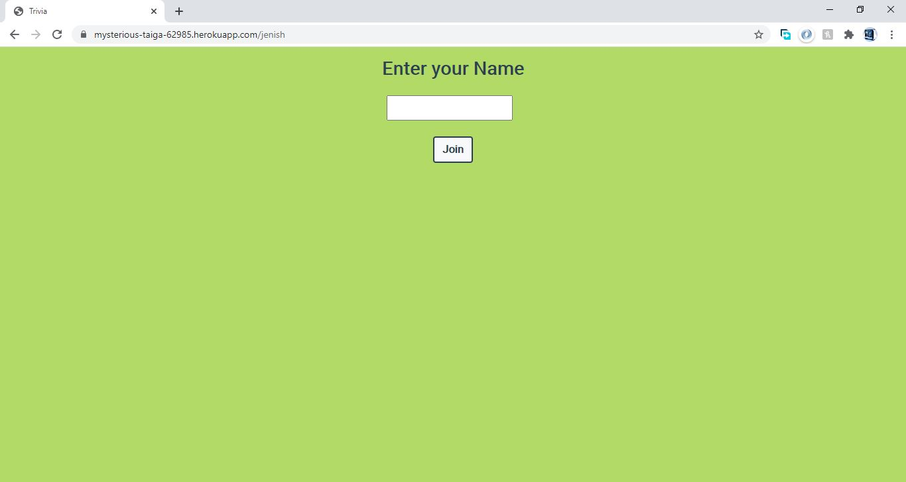

# Multiplayer-Trivia
Trivia game which can be played with friends. 
Allows players to create rooms, which other players can join using the room URL. 
Socket.io (a Nodejs module) is used to handle room creation and communication between players within a room. 
All rooms are connected to a main server. Questions are fetched using openTDB API.

Room Creation page.

Joining a Room

Game in Progress

Waiting for Other Platers in room to finish

